# Navegacion entre paginas con Flutter
# Osvaldo Arellano Gpo 6J

# mi prompt o pregunta AI
#1

Crea una página de inicio en Flutter llamada PaginaUno para una papelería llamada 'La Casita de Papel'. La interfaz debe incluir un AppBar color guinda con iconos de lista y usuario, un BottomNavigationBar con tres opciones (Inicio, Productos, Contacto) que maneje navegación por rutas, y un cuerpo con un Banner central que contenga una imagen de red enmarcada por bordes rojos gruesos. Debajo, añade una sección de 'Novedades' con un botón circular rojo que use una flecha para navegar, y finaliza con un eslogan en negritas e itálicas que diga '¡Tu Papelería de Confianza!'.

#2

Diseña la pantalla de Contacto para mi app de papelería. Usa los mismos colores guinda y blanco y la barra de navegación de las otras páginas. Pon un icono grande arriba, un mensaje de bienvenida y dos cuadritos con sombra que muestren el correo y el teléfono del negocio. Para terminar, pon la foto de la papelería en un recuadro elegante con esquinas redondeadas y sombra para que resalte.

#3

Crea una página de catálogo en Flutter para la sección de 'Material Didáctico'. Mantén el mismo diseño de barra superior e inferior en color guinda. En la parte de arriba del cuerpo, añade un botón de retroceso junto a un título centrado. Lo más importante es que los productos se muestren en una cuadrícula organizada de 3 columnas, donde cada producto sea un cuadrito rojo con esquinas redondeadas. Cada cuadrito debe incluir una imagen del producto (cargada de internet) sobre un fondo blanco pequeño, el nombre del material y su precio debajo. Haz que al tocar cualquier producto, la app te lleve a otra página.

#Android
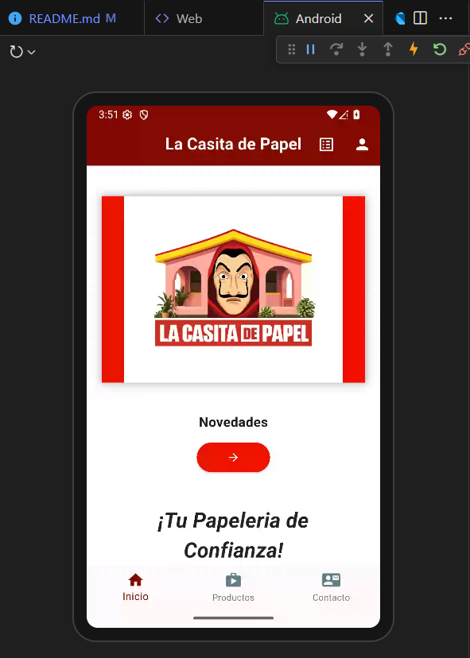
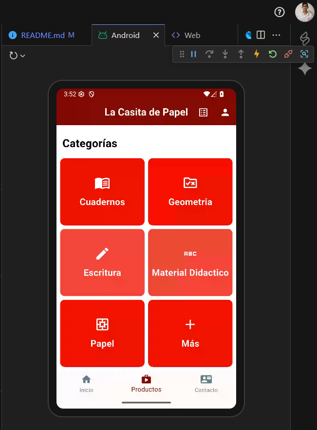
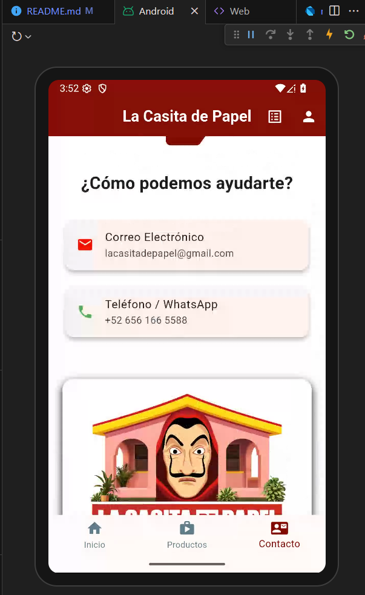
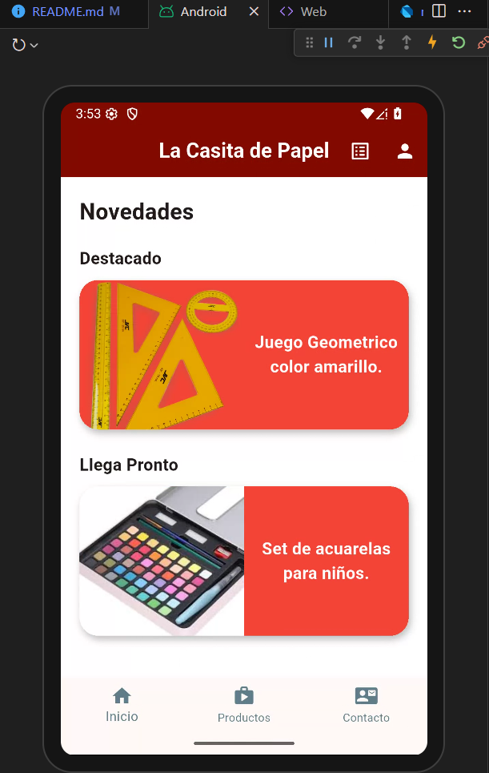
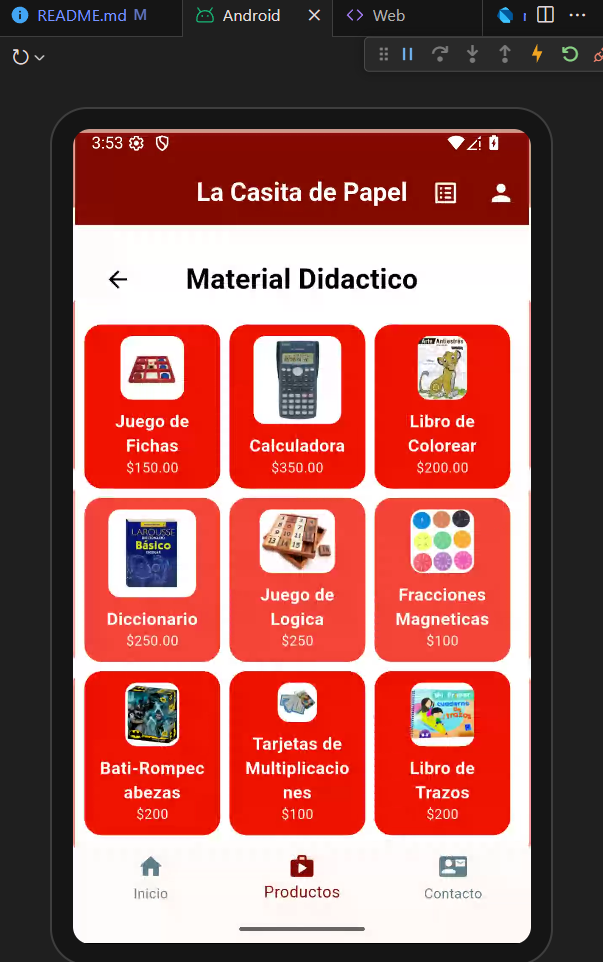
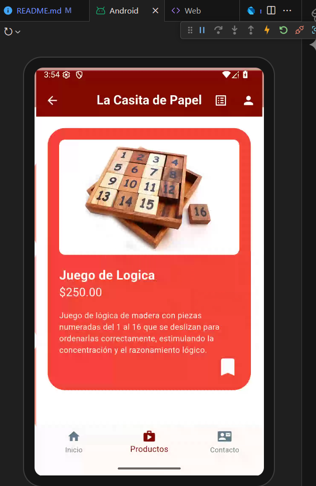

#Web
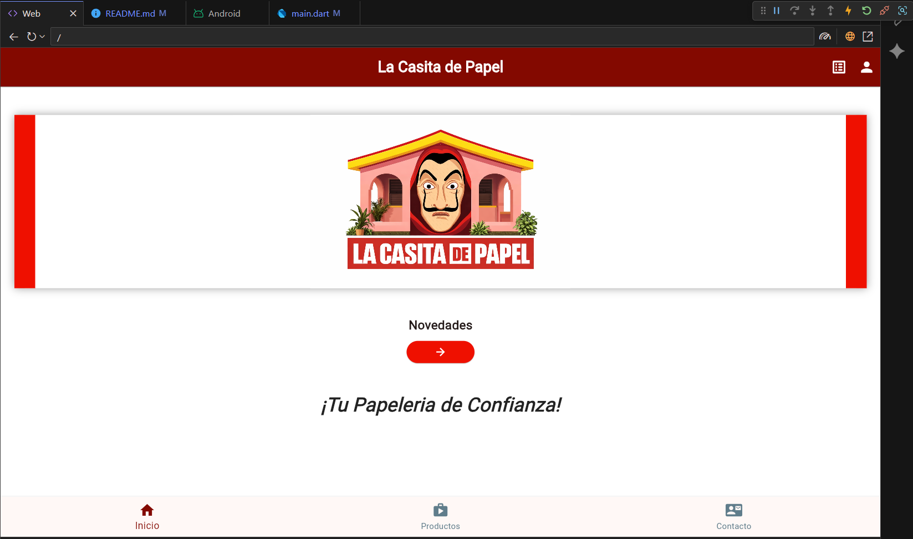
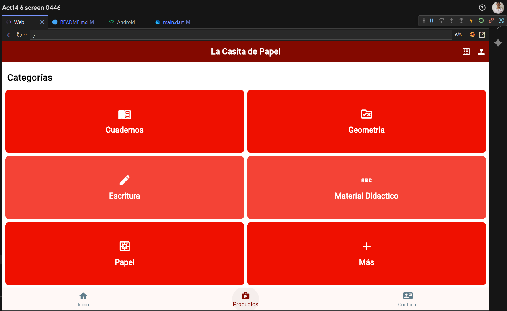
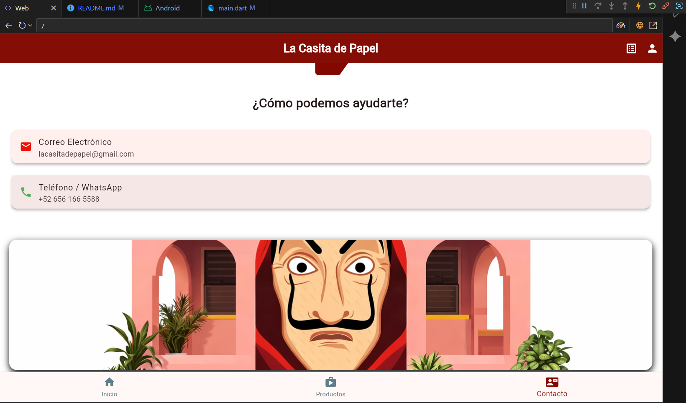
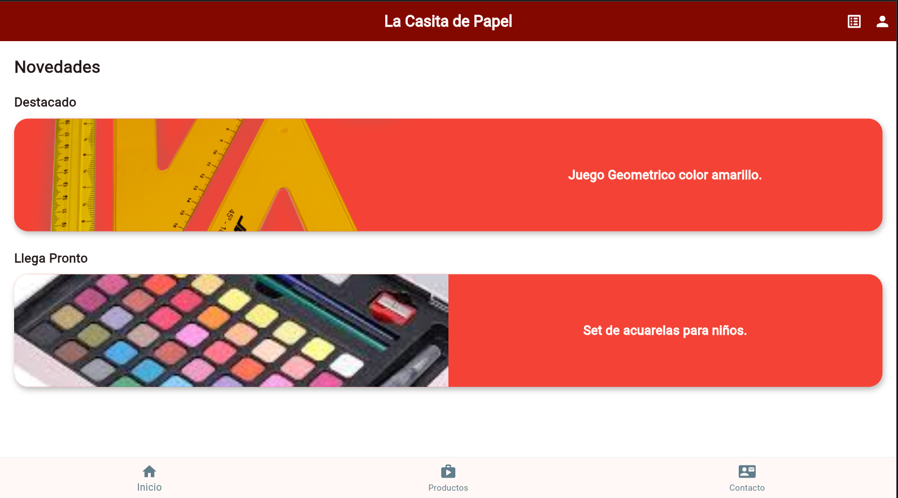
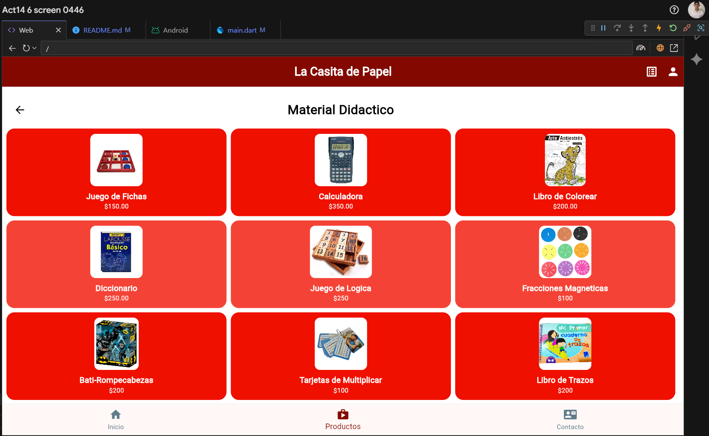
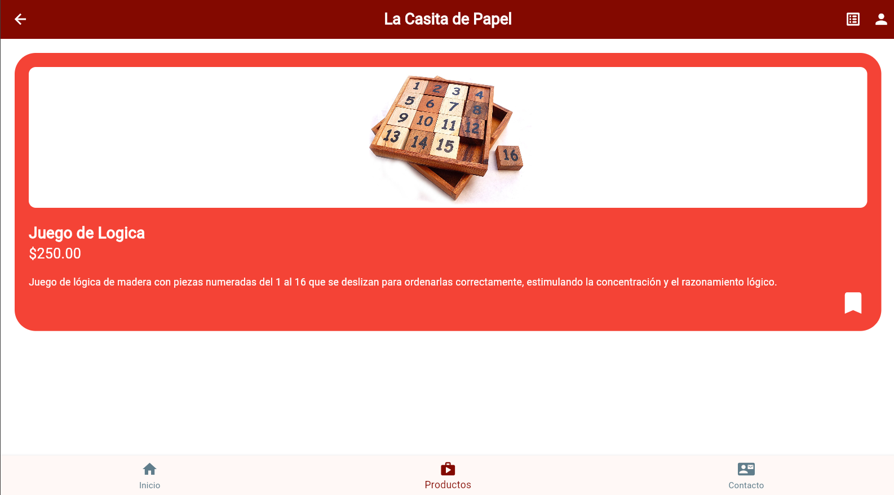
